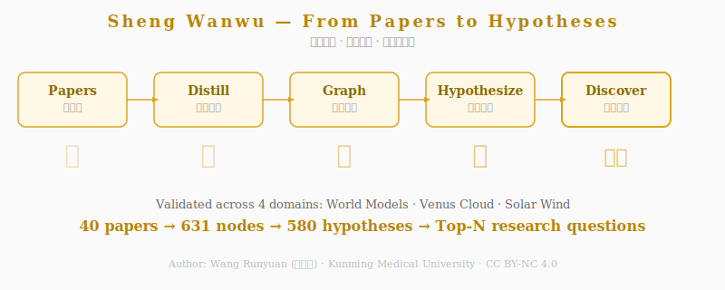

# 生万物论 (Shēng Wàn Wù)
# Sheng Wanwu Lun — Theory of Generating Infinite Phenomena

> **道生一 · 一生二 · 二生三 · 三生万物**
>
> 从学术论文库到可行动研究假说的自动发现引擎
>
> **The Dao generates One · One generates Two · Two generates Three · Three generates Infinite Phenomena**
>
> An engine that automatically discovers actionable research hypotheses from a library of academic papers.

**作者：王润圆** · 昆明医科大学 · 营养与食品卫生学硕士

**Author: Wang Runyuan** · Kunming Medical University · Master of Nutrition and Food Hygiene



---

## 快速开始 / Quick Start

```bash
# 1. 克隆仓库并安装依赖 / Clone the repo and install dependencies
pip install trafilatura pymupdf

# 2. 放入论文 / Drop your papers in (PDF or HTML)
mkdir -p papers/ && cp /your/papers/*.pdf papers/

# 3. 一条龙：蒸馏 → 图谱 → 假说 → 排序
#    Full pipeline: distill → graph → hypothesize → rank
python shengwanwu/distill.py            --input papers/  --output library/
python shengwanwu/hypothesis_scan_v02.py --library library/
python shengwanwu/reconstruct_v03.py     --library library/
python shengwanwu/collect_rank.py        --library library/

# 4. 查看结果 / View results
#    → library/ranked_results.json （Top-N 研究问题 / Top-N research questions）
```

想先看效果？直接运行附带的示例（见下方"示例数据"）。

Want to see it in action first? Run the bundled examples (see "Example Data" below).

---

## 这是什么？ / What Is This?

《生万物论》是一个轻量级研究工具，能从一批学术论文中自动：

1. 蒸馏知识节点（方法、发现、概念、局限）
2. 构建跨论文知识图谱
3. 检测知识空白与矛盾
4. 生成可证伪的研究假说
5. 排序输出 Top-N 研究问题

Sheng Wanwu Lun is a lightweight research tool that, from a batch of academic papers, automatically:

1. Distills knowledge nodes (methods, findings, concepts, limitations)
2. Builds a cross-paper knowledge graph
3. Detects knowledge gaps and contradictions
4. Generates falsifiable research hypotheses
5. Ranks and emits the Top-N research questions

## 使用流程 / Usage

### 环境要求 / Requirements

- Python 3.10+
- 需要的包 / Required packages: `pip install trafilatura pymupdf`

### 运行流程 / Running the Pipeline

```bash
# 第一步：准备论文库
# Step 1: Prepare the paper library
# 将你的论文放入 papers/ 目录（支持 PDF 和 HTML）
# Put your papers into the papers/ directory (PDF and HTML supported)

# 第二步：蒸馏知识节点 / Step 2: Distill knowledge nodes
python shengwanwu/distill.py --input papers/ --output library/

# 第三步：构建知识图谱（自动）/ Step 3: Build the knowledge graph (automatic)
python shengwanwu/hypothesis_scan_v02.py --library library/

# 第四步：生成研究假说 / Step 4: Generate research hypotheses
python shengwanwu/reconstruct_v03.py --library library/

# 第五步：收集排序 / Step 5: Collect and rank
python shengwanwu/collect_rank.py --library library/
```

### 示例数据 / Example Data

本仓库包含两个已跑通的示例：

This repository includes two ready-to-run examples:

- `examples/venus_cloud/` — 金星云层生命研究（6篇论文 → 175节点 → 96假说）
  Venus cloud-life study (6 papers → 175 nodes → 96 hypotheses)
- `examples/world_models/` — 世界模型研究（25篇论文 → 231节点 → 107假说）
  World models study (25 papers → 231 nodes → 107 hypotheses)

## 四层架构 / The Four-Generation Architecture

从论文库到假说，整条流水线对应《道德经》的生成次第：

From paper library to hypotheses, the whole pipeline mirrors the generative order of the Tao Te Ching:

```
道（原始论文）              The Dao (raw papers)
  ↓ 蒸馏 / Distillation
一（知识节点：方法/发现/概念/局限）
One (knowledge nodes: method / finding / concept / limitation)
  ↓ 图谱 / Knowledge Graph
二（跨论文知识网络：6种模式检测）
Two (cross-paper knowledge network: 6-pattern detection)
  ↓ 重构 / Reconstruction
三（语义假说：可证伪+实验方案）
Three (semantic hypotheses: falsifiable + experiment plan)
  ↓ 排序 / Ranking
万物（Top-N 可行动研究问题）
Infinite Phenomena (Top-N actionable research questions)
```

## 核心脚本说明 / Core Scripts

| 脚本 / Script | 功能 / Function | 输入 / Input | 输出 / Output |
|------|------|------|------|
| `hypothesis_scan_v02.py` | 知识图谱+假说检测<br>Knowledge graph + hypothesis detection | node_store + graph_edges | hypothesis_candidates.json |
| `reconstruct_v03.py` | LLM语义重构（三层架构）<br>LLM semantic reconstruction (3-layer) | 候选假说 + 知识上下文<br>Candidate hypotheses + knowledge context | 结构化研究问题<br>Structured research questions |
| `physics_hypotheses.py` | 物理导向假说生成<br>Physics-oriented hypothesis generation | 局限/不确定性节点<br>Limitation / uncertainty nodes | 物理假说<br>Physics hypotheses |
| `collect_rank.py` | 去重+grounding+排序<br>Dedup + grounding + ranking | 所有假说结果<br>All hypothesis results | ranked_results.json |

## 设计原则 / Design Principles

1. **由库成论 / From Paper Library to Hypotheses**：一切假说从蒸馏的论文全文中生成，可追溯。
   Every hypothesis is generated from the distilled full text of papers, and each is traceable to its source.
2. **六眼旁观 / Six Eyes Watching**：六种模式检测器多角度审视知识网络。
   Six pattern detectors examine the knowledge network from multiple angles.
3. **可证伪 / Falsifiable**：每条假说包含明确的证伪条件。
   Every hypothesis carries explicit falsification conditions.
4. **低功耗 / Low Power**：确定性工作交脚本，判断性工作交LLM。
   Deterministic work goes to scripts; judgment-heavy work goes to the LLM.

## 技术栈 / Tech Stack

- 论文获取 / Paper acquisition：curl + trafilatura + PyMuPDF
- 知识蒸馏 / Knowledge distillation：并行分神（daemon）处理，DeepSeek / Claude Code
  Parallel daemon processing with DeepSeek / Claude Code
- 知识图谱 / Knowledge graph：Python 原生，共享标签 → 边连接
  Native Python, shared tags → edge links
- 假说重构 / Hypothesis reconstruction：类型特定 prompt 模板 + LLM 语义生成
  Type-specific prompt templates + LLM semantic generation
- 运行于灵台（LingTai）生态 / Built on the LingTai ecosystem

## 许可 / License

**禁止商用** — 本仓库所有内容采用 [CC BY-NC 4.0](https://creativecommons.org/licenses/by-nc/4.0/) 许可证。

**No commercial use** — All content in this repository is licensed under [CC BY-NC 4.0](https://creativecommons.org/licenses/by-nc/4.0/).

© 王润圆 (Wang Runyuan) 2026. 保留所有权利 / All rights reserved.

- ✅ 允许 / Allowed：分享、改编、学习研究使用
  Sharing, adaptation, and use for study and research
- ❌ 禁止 / Prohibited：任何形式的商业使用
  Any form of commercial use
- 使用时须署名 / Attribution required：王润圆 · 昆明医科大学营养与食品卫生学硕士
  Wang Runyuan · Kunming Medical University · Master of Nutrition and Food Hygiene

---

*Powered by 灵台 LingTai*
